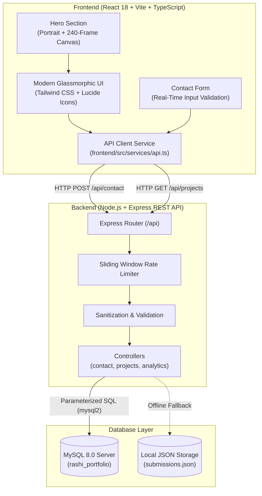

# Rashi Koiri — Full-Stack AI/ML Portfolio

A full-stack personal portfolio and engineering showcase for **Rashi Koiri**, 2nd Year Computer Science and Engineering student specializing in **Artificial Intelligence & Machine Learning** at **Adamas University**.

Built with **React 18**, **TypeScript**, **Vite**, **Tailwind CSS**, **Node.js**, **Express.js**, and a relational **MySQL** backend. Features a 240-frame interactive canvas scroll scrubber, authentic student project showcases, typed skill matrices, and a RESTful contact submission system.

---

## 🔗 Official Online Profiles

- **GitHub Repository**: [https://github.com/rashikoiri1-tech/rashi-portfolio.git](https://github.com/rashikoiri1-tech/rashi-portfolio.git)
- **LinkedIn Profile**: [https://www.linkedin.com/in/rashi-koiri-73a074384](https://www.linkedin.com/in/rashi-koiri-73a074384)
- **website portfolio**:[Portfolio Website: https://rashi0-portfolio.vercel.app]


---

## 📐 Architecture Overview



---

## 🌟 Key Features

1. **Cinematic Hero Experience**:
   - High-resolution personal portrait with subtle lighting effects.
   - Dual-view toggle featuring a **240-frame interactive 3D kinematic canvas** with scroll scrubbing, drag slider, play/pause, and auto-rotation.
   - Live availability pill, academic metrics, and immediate CTAs.
2. **Authentic Project Showcase**:
   - **Human Resource Management System (HRMS)**: Full-stack CRUD with React, Express, and MySQL.
   - **Smart College Event Management System**: Campus event scheduling, participant roster tracking, and category-wise registrations.
   - **AI-Based Placement Preparation Platform**: AI mock interview evaluation and question bank concept.
   - **Food Rescue & Redistribution Platform**: Social impact logistics architecture connecting surplus food to NGOs.
   - **AI / ML Modeling & Algorithm Lab**: Python data exploration, regression/classification, and model notebooks.
3. **Realistic Technical Skills**:
   - Skills categorized into **Building With**, **Practicing**, and **Learning** tiers across Programming, Frontend, Backend, Databases, AI/ML, Tools, and CS Fundamentals.
4. **Interactive "What I Build"**:
   - 6 structured capability cards highlighting full-stack engineering, REST APIs, and algorithmic problem solving.
5. **Full-Stack Contact Engine**:
   - Connects React form directly to Express REST API with parameterized SQL insertions into MySQL `contacts` table and sliding-window rate limiting.
6. **Graceful Offline Fallback**:
   - If MySQL is not running locally during development, the backend automatically logs a notice and stores messages safely in `submissions.json` so the app remains fully functional.

---

## 📂 Project Structure

```
portfolio/
├── frontend/
│   ├── public/
│   │   ├── frames/                 # 240 canvas animation frames
│   │   └── images/
│   │       ├── profile/            # rashi-koiri.jpeg (Portrait)
│   │       ├── projects/           # High-contrast SVGs for showcase
│   │       └── brand/              # logo.svg
│   ├── src/
│   │   ├── components/             # Navbar, Hero, About, Services, TechStack,
│   │   │                           # Projects, Achievements, Testimonials, Contact, Footer
│   │   ├── data/                   # profile.ts, projects.ts, skills.ts, achievements.ts
│   │   ├── services/               # api.ts (HTTP client)
│   │   ├── hooks/                  # useScrollProgress, useMousePosition, useMediaQuery
│   │   ├── styles/                 # globals.css, animations.css, responsive.css
│   │   ├── App.tsx
│   │   └── main.tsx
│   ├── index.html
│   ├── package.json
│   ├── tsconfig.json
│   └── vite.config.ts
├── backend/
│   ├── src/
│   │   ├── config/                 # database.js, serverConfig.js
│   │   ├── controllers/            # contactController, projectController, analyticsController
│   │   ├── middleware/             # errorHandler, rateLimiter, validation
│   │   ├── routes/                 # contactRoutes, projectRoutes, analyticsRoutes, healthRoutes
│   │   └── server.js
│   ├── .env.example
│   └── package.json
├── database/
│   ├── schema.sql                  # MySQL table creation script
│   ├── seed.sql                    # Initial seed projects and sample analytics
│   └── README.md                   # MySQL Workbench setup guide
├── dev.js                          # Concurrent zero-dependency development runner
├── package.json
├── .gitignore
└── README.md
```

---

## 🚀 Quick Start & Running Locally

### 1. Prerequisites
- **Node.js** (v18 or higher recommended)
- **MySQL Community Server** (v8.0+ optional for database persistence)

### 2. Install Dependencies
In the root directory, run:

```powershell
npm install
npm run install:all
```

This installs dependencies for both the root runner, the frontend (`React`, `Lucide`, `Tailwind`), and the backend (`Express`, `mysql2`, `cors`, `dotenv`).

### 3. Run Dev Environment Concurrently
Start both frontend and backend concurrently with a single command:

```powershell
npm run dev
```

- **Frontend Application**: [http://localhost:5173](http://localhost:5173)
- **Backend REST API**: [http://localhost:5000](http://localhost:5000)

---

## 🗄️ Database Setup (MySQL)

1. Open **MySQL Workbench** or your MySQL command line client.
2. Execute `database/schema.sql` to create the `rashi_portfolio` database and its tables (`contacts`, `projects`, `analytics`).
3. Execute `database/seed.sql` to populate initial project showcases.
4. Copy `backend/.env.example` to `backend/.env` and update your MySQL password:

```env
PORT=5000
NODE_ENV=development
CLIENT_URL=http://localhost:5173

DB_HOST=localhost
DB_USER=root
DB_PASSWORD=your_mysql_password
DB_NAME=rashi_portfolio
DB_PORT=3306
```

> **Note**: If MySQL is offline, the backend continues to run in fallback mode without crashing.

---

## 📡 REST API Documentation

| Method | Endpoint | Description |
|---|---|---|
| `GET` | `/api/health` | Diagnostic health check and database connection status |
| `GET` | `/api/projects` | List all portfolio projects from MySQL or bundled dataset |
| `GET` | `/api/projects/:id` | Retrieve single project by numeric ID or slug |
| `POST` | `/api/contact` | Submit contact inquiry (Validated, rate-limited, saved to MySQL) |
| `GET` | `/api/contact/submissions` | Retrieve contact inquiry audit log |
| `POST` | `/api/analytics` | Record page impression telemetry |
| `GET` | `/api/analytics` | View visitor statistics |

---

## 🌿 Git & Deployment Workflow

```powershell
# Check status
git status

# Stage verified changes
git add .

# Commit with clean descriptive message
git commit -m "feat: complete full-stack portfolio for Rashi Koiri with React, Express, MySQL & canvas animation"

# Push to GitHub
git push origin main
```

---

## 📄 License & Attribution

© 2026 **Rashi Koiri**. All rights reserved.  
Student at Adamas University — B.Tech Computer Science & Engineering (AI/ML).
